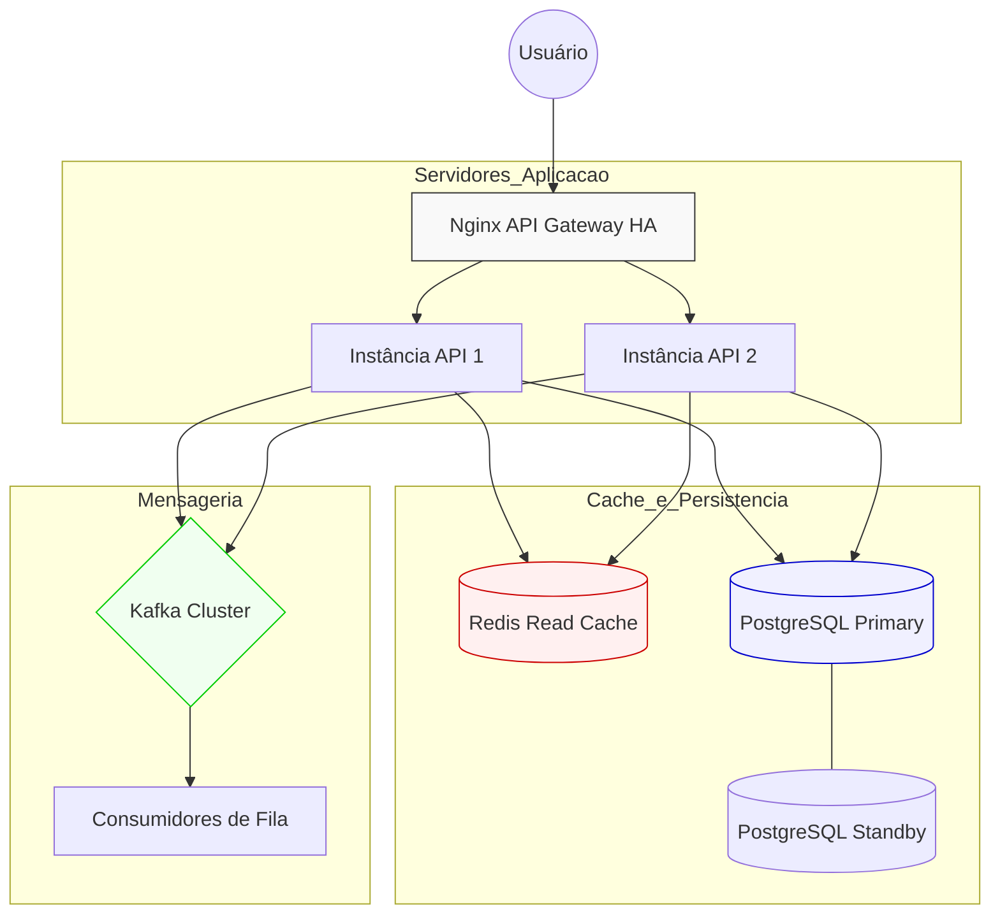

# Documentação de Arquitetura: Solução On-Premises

Este documento detalha a infraestrutura para uma aplicação fictícia de Processamento de Pagamentos de alta disponibilidade.

## 1. Diagrama de Alto Nível (Mermaid)

## 2. Componentes Principais
**Nginx:** Responsável pelo balanceamento de carga e terminação SSL/TLS.

**Redis:** Cache de dados frequentes para redução de latência.

**Kafka:** Garantia de entrega de mensagens e desacoplamento de serviços.

**PostgreSQL:** Armazenamento relacional persistente com integridade ACID.

## 3. Alta Disponibilidade e Segurança
### Alta Disponibilidade (HA)
- **Nginx:** Configurado em modo Ativo/Passivo (ou Ativo/Ativo com VIP) para garantir que o ponto de entrada da API permaneça acessível mesmo em caso de falha de hardware.
- **PostgreSQL:** Arquitetura Primary-Standby utilizando *Streaming Replication*. Em caso de falha do nó primário, o *failover* pode ser acionado para promover a réplica.
- **Kafka:** Cluster com múltiplos *brokers* e fator de replicação configurado nos tópicos (ex: RF=3) para garantir durabilidade e disponibilidade das mensagens.
- **Redis:** Configuração Master-Replica com Sentinel para monitoramento e *failover* automático.

### Segurança
- **Rede:** Segmentação de rede (VLANs/Subnets) onde apenas o Nginx é exposto publicamente (DMZ). Banco de dados e filas residem em rede privada.
- **Criptografia:** TLS (Transport Layer Security) habilitado para comunicação entre microsserviços e banco de dados (dados em trânsito).
- **Hardening:** Ocultação de versões de software (ex: `server_tokens off` no Nginx) e princípio do menor privilégio para usuários de banco de dados e sistema operacional.